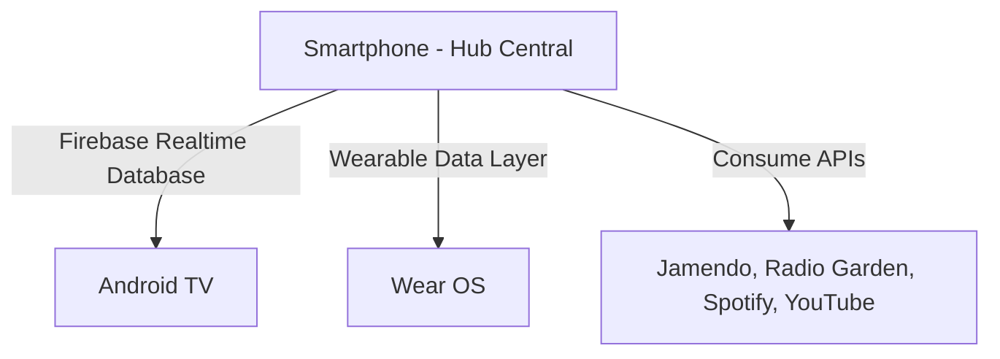

# Sintonía — Control Multimedia Inteligente para el Ecosistema Digital

## Información del Proyecto

| Campo | Detalle |
| :--- | :--- |
| **Nombre del proyecto** | Sintonía |
| **Estudiantes** | Medrano Hernández Vanesa Monserrat · Tapia Cid Laura Berenice |
| **Matrícula** | 1222100447 · 1222100476 |
| **Grupo** | GIDS6093 |
| **Materia** | Desarrollo para Dispositivos Inteligentes |
| **Docente** | Rodríguez García Anastacio |
| **Institución** | Universidad Tecnológica del Norte de Guanajuato |
| **Periodo** | Mayo – Agosto 2026 |

---

## Objetivo

Desarrollar un sistema de control multimedia multiplataforma que integre Smartwatch, Smartphone y Smart TV, combinando fuentes de contenido gratuito y legal (Jamendo y Radio Garden) con comunicación en tiempo real entre los tres dispositivos a través de Firebase Realtime Database.

---

## Descripción de Funcionalidades

### Smartphone (Hub Central)
*   **Selección de fuente:** Jamendo, Radio Garden y Spotify.
*   **Búsqueda y reproducción:** Acceso a música gratuita con licencia Creative Commons (Jamendo API).
*   **Pantalla de Favoritos:** Función para guardar pistas y acceder rápidamente a ellas, superando las limitaciones de descarga directa de servicios como Spotify.
*   **Streaming Flexible:** Opción para alternar instantáneamente la salida de audio/video entre el Smartphone y la Smart TV.
*   **Gestión:** Reproductor con controles y sincronización total del estado hacia Firebase.
*   **Control Remoto:** Recepción de comandos enviados desde el Smartwatch.

### Smartwatch (Wear OS)
*   Visualización de la canción en reproducción (título y artista).
*   Control de play/pausa directamente desde la muñeca.
*   Sincronización en tiempo real vía Firebase Realtime Database.

### Android TV (Dashboard)
*   **Dashboard Visual:** Muestra portada del álbum, título y artista.
*   **Cola de Reproducción:** Visualización en tiempo real de la lista de próximas canciones, sincronizada automáticamente con el Smartphone.
*   **Indicador de estado:** Estado (reproduciendo / pausado) y visualizador de ondas.
*   **Control Remoto:** Actualización en tiempo real controlada desde el smartphone vía Firebase.

---

## Diagrama de Arquitectura


## 🛠️ Tecnologías Utilizadas

| Tecnología | Uso |
|---|---|
| **Kotlin** | Lenguaje principal |
| **Jetpack Compose** | UI declarativa en los 3 módulos |
| **Material Design 3** | Sistema de diseño |
| **Wear OS SDK** | Módulo smartwatch |
| **Android TV** | Módulo Smart TV |
| **Firebase Realtime Database** | Comunicación en tiempo real |
| **Jamendo API** | Música gratuita bajo Creative Commons |
| **ExoPlayer (Media3)** | Reproducción de audio |
| **Retrofit 2 + OkHttp** | Consumo de APIs REST |
| **Coil** | Carga de imágenes |
| **MVVM + Repository Pattern** | Arquitectura de software |
| **Android Studio** | IDE de desarrollo |
| **Git + GitHub** | Control de versiones |

---

## Estructura del Repositorio

```
sintonia/
├── app/                    # Módulo Smartphone (hub central)
├── wear/                   # Módulo Smartwatch (Wear OS)
├── tv/                     # Módulo Android TV
├── apk/
│   └── sintonia.apk        # APK generado de la app principal
├── evidencias/
│   ├── pantalla_principal.png
│   ├── navegacion.png
│   ├── jamendo_busqueda.png
│   ├── wear_os.png
│   └── android_tv.png
└── README.md
```

---

## Instrucciones para Ejecutar el Proyecto

### Requisitos previos
- Android Studio Hedgehog o superior
- JDK 11
- Cuenta en [Firebase Console](https://console.firebase.google.com)
- Cuenta en [Jamendo Developer Portal](https://devportal.jamendo.com) (gratuita)
- Emulador o dispositivo físico:
  - Android 8.0+ (API 26) para el smartphone
  - Wear OS para el smartwatch
  - Android TV para la TV

### Pasos

1. **Clona el repositorio**
   ```bash
   git clone https://github.com/Lau1907/sintonia.git
   cd sintonia
   ```

2. **Configura Firebase**
   - Crea un proyecto en [Firebase Console](https://console.firebase.google.com)
   - Agrega las apps: `com.sintonia.app`, `com.sintonia.wear`, `com.sintonia.tv`
   - Descarga cada `google-services.json` y colócalo en la carpeta raíz de cada módulo
   - Activa **Realtime Database** en modo test

3. **Configura Jamendo**
   - Regístrate en [devportal.jamendo.com](https://devportal.jamendo.com)
   - Crea una aplicación y copia tu **Client ID**
   - Pégalo en `app/src/main/java/com/sintonia/app/data/remote/JamendoApi.kt`
     ```kotlin
     @Query("client_id") clientId: String = "TU_CLIENT_ID_AQUI"
     ```

4. **Abre en Android Studio**
   - File → Open → selecciona la carpeta del proyecto
   - Espera a que Gradle sincronice

5. **Ejecuta cada módulo**
   - Smartphone: selecciona `:app` y corre en emulador de teléfono
   - Smartwatch: selecciona `:wear` y corre en emulador Wear OS
   - TV: selecciona `:tv` y corre en emulador Android TV

---

## Capturas de Pantalla

### Smartphone — Pantalla Principal


### Smartphone — Pantalla Principal y busqueda en Jamendo


### Smartphone — Pantalla de Spotify


### Smartphone — Pantalla de Radio Garden


### Smartphone — Pantalla de YouTube


### Smartphone — Pantalla de Descargas


### Smartphone — Pantalla de Favoritos


### Smartphone — Pantalla de Cola de Reproducción


### Smartwatch — Control de Reproducción


### Smartwatch — Pantalla de notificación


### Smartwatch — Pantalla de volumen


### Android TV — Pantalla de Spotify


### Android TV — Pantalla de Jamendo


### Android TV — Pantalla de Radio Garden


### Android TV — Pantalla de YouTube


---

## Explicación del Código Paso a Paso

Esta sección explica **todo el código del proyecto**, archivo por archivo y función por función, para que se pueda entender el funcionamiento completo de Sintonía sin necesidad de abrir el repositorio. Está organizada por módulo (`app`, `wear`, `tv`) y dentro de cada módulo, por capa (modelos → repositorios → ViewModel → UI → navegación).

### 0. Arquitectura general

El proyecto sigue **MVVM + Repository Pattern**, repetido con el mismo espíritu en los 3 módulos:

- **Model** (`data/model/`) → clases de datos puras (`Song`, `PlaybackState`, etc.), sin lógica.
- **Repository** (`data/remote/`, `data/firebase/`) → una clase por cada fuente externa (Jamendo, Spotify, Radio, YouTube, Firebase). Su única responsabilidad es hablar con una API o con Firebase y regresar objetos ya limpios.
- **ViewModel** (`viewmodel/PlayerViewModel.kt`) → existe **solo en el módulo `app`**. Es el cerebro de todo el sistema: llama a los repositorios, controla los reproductores reales (ExoPlayer y Spotify App Remote) y expone el estado como `StateFlow` para que la UI reaccione.
- **UI (Jetpack Compose)** → pantallas `@Composable` que solo leen `StateFlow` con `collectAsState()` y llaman funciones del ViewModel desde los `onClick`; no contienen lógica de negocio ni tocan Firebase directamente.

`wear` y `tv` **no tienen ViewModel propio**: son clientes ligeros que leen/escriben directo en Firebase Realtime Database con `DisposableEffect`/`LaunchedEffect`. El teléfono (`app`) es el único dispositivo que controla la reproducción real.

### 1. El "pizarrón" compartido: Firebase Realtime Database

Todo el proyecto gira alrededor de un único nodo: `playback`. Ahí vive el estado actual de reproducción, y los 3 módulos lo escuchan en tiempo real:

```
playback/
├── isPlaying       (Boolean)
├── currentSong/    (title, artist, albumCover, audioUrl, duration...)
├── volume          (Int)
├── source          (String: "jamendo" | "spotify" | "radio" | "youtube")
├── playOnTv        (Boolean)
├── progress        (Float, 0.0 a 1.0)
├── queue/          (lista de próximas canciones)
├── skipSong        (String: "next" | "previous" — comando temporal del reloj)
└── tvCommand       (String: "play" | "pause" — comando temporal de la TV)

descargas/          (nodo aparte: canciones descargadas, keyed por song.id)
favoritos/          (nodo aparte: canciones favoritas, keyed por song.id)
```

`skipSong` y `tvCommand` son "comandos" de un solo uso: un dispositivo escribe el valor, el teléfono lo escucha, lo ejecuta y **se borra a sí mismo** (`snapshot.ref.setValue(null)`) para no volver a dispararse en bucle.

---

## MÓDULO `app` (Smartphone — hub central)

### 1.1 `data/model/Song.kt`

```kotlin
data class Song(
    val id: String = "", val title: String = "", val artist: String = "",
    val albumCover: String = "", val audioUrl: String = "", val duration: Int = 0,
    val source: String = "jamendo", val tamanoMb: Float = 0f,
    val progresoDescarga: Int = 0, val descargada: Boolean = false
)
```
Es el modelo universal de "canción". Sirve tanto para una pista de Jamendo, una de Spotify, un video de YouTube o una estación de radio — lo único que cambia es el campo `source`. `progresoDescarga` y `descargada` solo se usan cuando la canción está en el nodo `descargas`.

### 1.2 `data/model/PlaybackState.kt`

```kotlin
data class PlaybackState(
    @get:PropertyName("isPlaying") @set:PropertyName("isPlaying")
    var isPlaying: Boolean = false,
    var currentSong: Song = Song(),
    var volume: Int = 70,
    var source: String = "jamendo"
)
```
Es exactamente lo que se sincroniza en el nodo `playback` de Firebase. Las anotaciones `@PropertyName` existen porque Firebase, por convención, intenta convertir `isPlaying` en el getter `playing` (regla de Java Beans) al serializar; con `@PropertyName("isPlaying")` se fuerza a que el nombre del campo en la base de datos sea literal `isPlaying`.

### 1.3 `data/firebase/FirebaseRepository.kt` — toda la comunicación con Firebase

Tiene 3 responsabilidades, cada una con su propio nodo: **reproducción**, **descargas** y **favoritos**.

```kotlin
class FirebaseRepository {
    private val db = FirebaseDatabase.getInstance().reference.child("playback")
    private val dbDescargas = FirebaseDatabase.getInstance().reference.child("descargas")
    private val dbFavoritos = FirebaseDatabase.getInstance().reference.child("favoritos")
```

- **`observePlaybackState(): Flow<PlaybackState>`** — usa `callbackFlow` para convertir el `ValueEventListener` de Firebase (que funciona por callbacks `onDataChange`/`onCancelled`) en un `Flow` de Kotlin que el ViewModel puede recorrer con `.collect { }`:
  ```kotlin
  fun observePlaybackState(): Flow<PlaybackState> = callbackFlow {
      val listener = object : ValueEventListener {
          override fun onDataChange(snapshot: DataSnapshot) {
              snapshot.getValue(PlaybackState::class.java)?.let { trySend(it) }
          }
          override fun onCancelled(error: DatabaseError) {}
      }
      db.addValueEventListener(listener)
      awaitClose { db.removeEventListener(listener) }   // limpieza al cancelar la coroutine
  }
  ```
- **`updatePlaybackState(state)`** — sube el nuevo estado a Firebase. **Detalle importante documentado en el propio código**: antes usaba `db.setValue(state)`, que reemplaza *todo* el nodo `playback` y borraba campos que no forman parte de `PlaybackState` (como `queue` o `playOnTv`). Se corrigió usando `updateChildren()`, que solo toca los 3 campos indicados:
  ```kotlin
  fun updatePlaybackState(state: PlaybackState) {
      val updates = mapOf<String, Any?>(
          "isPlaying" to state.isPlaying,
          "currentSong" to state.currentSong,
          "source" to state.source
      )
      db.updateChildren(updates)
  }
  ```
- **`updateQueue(songs)`** — solo sube las primeras 3 canciones de la cola (como `title`/`artist`) para que la TV las muestre, sin mandar el objeto `Song` completo.
- **`updateIsPlaying`, `updatePlayOnTv`, `updateProgress`, `updateCurrentSong`** — setters puntuales sobre campos individuales del nodo `playback`.
- **`observeDownloads()` / `saveDownload()` / `removeDownload()`** — igual que `observePlaybackState` pero sobre el nodo `descargas`; `snapshot.children.mapNotNull { it.getValue(Song::class.java) }` convierte todos los hijos del nodo en una `List<Song>`.
- **`observeFavorites()` / `saveFavorite()` / `removeFavorite()`** — mismo patrón, sobre el nodo `favoritos`.

### 1.4 `data/remote/` — un repositorio por cada fuente de música

Todos siguen la misma receta: (1) una interfaz Retrofit con las rutas de la API, (2) un repositorio que construye el cliente Retrofit y traduce la respuesta cruda al modelo `Song` interno.

**`JamendoApi.kt` + `JamendoRepository.kt`** (Jamendo, API pública sin login):
```kotlin
interface JamendoApi {
    @GET("tracks/")
    suspend fun searchTracks(
        @Query("client_id") clientId: String = "dc3bc61a",
        @Query("namesearch") search: String, ...
    ): JamendoResponse
}
```
`JamendoRepository` calcula el tamaño estimado en MB de cada pista porque Jamendo no lo regresa directamente, asumiendo un bitrate típico de streaming de 128 kbps:
```kotlin
private fun calcularTamanoMb(durationSeconds: Int, bitrateKbps: Int = 128): Float =
    (durationSeconds * bitrateKbps) / (8f * 1024f)
```
`getPopularTracks()` y `searchTracks(query)` llaman a la API, mapean cada `JamendoTrack` a un `Song` con `source = "jamendo"`, y atrapan cualquier excepción regresando una lista vacía (para que la UI nunca truene por un error de red).

**`RadioBrowserService.kt` / `RadioRepository.kt`** (la pantalla dice "Radio Garden", pero el consumo real es contra la API pública de **radio-browser.info**):
```kotlin
private val service: RadioBrowserService by lazy {
    Retrofit.Builder().baseUrl("https://de1.api.radio-browser.info/")...
}
suspend fun getTopStations(): List<RadioStation> =
    service.getTopStations()
        .filter { it.url_resolved.isNotEmpty() }   // descarta estaciones sin stream
        .map { RadioStation(id = it.stationuuid, name = it.name, city = it.country,
            genre = it.tags.split(",").firstOrNull()?.trim() ?: "Radio",
            streamUrl = it.url_resolved) }
```
`searchStations(query)` hace lo mismo pero contra el endpoint de búsqueda por nombre.

**`SpotifyAuthManager.kt`** — arma el `AuthorizationRequest` del SDK oficial de Spotify (login OAuth vía navegador embebido), pidiendo los scopes `streaming`, `user-read-playback-state`, `user-modify-playback-state` y `user-read-currently-playing`. `REQUEST_CODE = 1337` es el código que `MainActivity.onActivityResult` usa para identificar la respuesta de este login.

**`SpotifyApi.kt` + `SpotifyRepository.kt`** — cubre 3 cosas:
1. **Búsqueda** (`GET search`) — `searchTracks(query, token)` y `getFeaturedTracks(token)` (esta última busca literalmente `"top hits 2024"` para simular una sección de destacados) mapean `SpotifyTrack` a `Song`, usando `spotify:track:{id}` como `audioUrl` (una URI de Spotify, no un link de audio).
2. **Spotify Connect** — `getAvailableDevices(token)` (`GET me/player/devices`) regresa todos los dispositivos donde el usuario tiene Spotify abierto (celular, TV, bocina, etc.).
3. **Transferencia** — `transferPlayback(token, deviceId, play)` (`PUT me/player`) mueve la reproducción activa a otro dispositivo; Spotify regresa `204 No Content` si sale bien (por eso el tipo de retorno es `Response<Unit>`).

Todas las funciones envuelven las llamadas en `try/catch` distinguiendo `HttpException` (errores HTTP con código y cuerpo) de errores genéricos, y loguean con la etiqueta `"SpotifyRepository"`.

**`SpotifyPlayerManager.kt`** — envuelve el SDK nativo `SpotifyAppRemote` (control real del reproductor de Spotify en el cel, distinto de la API REST):
- **`connect()`** — abre la conexión y se suscribe a `subscribeToPlayerState()`. Cada vez que Spotify cambia de estado (canción, pausa, progreso), este callback actualiza un set de `MutableStateFlow` (`_currentTrackName`, `_isPaused`, `_progress`, etc.) y detecta si cambió de canción comparando `uri` contra `lastTrackUri`.
- **`startProgressTimer(duration)`** — Spotify no manda la posición de reproducción en cada tick, así que se simula localmente con un `while(isActive) { delay(500) }`, calculando la posición estimada a partir de `lastPlaybackPosition` + tiempo transcurrido. Cuando el progreso llega a 98%, marca `_onTrackFinished = true` para que el ViewModel dispare la siguiente canción de la cola.
- **`playSong()`, `skipNext()`, `skipPrevious()`, `pause()`, `resume()`, `addToQueue()`** — llaman directo a `spotifyAppRemote?.playerApi`.
- **`disconnect()`** — cancela el timer, cancela el `CoroutineScope` y desconecta el SDK.

**`YouTubeApi.kt` + `YouTubeRepository.kt`** — `searchVideos(query, apiKey)` llama al endpoint `search` de la YouTube Data API v3 y mapea cada resultado a `YouTubeVideo` (armando la URL final como `https://www.youtube.com/watch?v={videoId}`).

### 1.5 `viewmodel/PlayerViewModel.kt` — el cerebro de la app (~800 líneas)

Declara los repositorios (`jamendoRepo`, `spotifyRepository`, `firebaseRepo`, `radioRepo`, `youtubeRepo`), un `ExoPlayer` para Jamendo/radio/YouTube y un `SpotifyPlayerManager` para Spotify. Todo el estado se expone como pares `MutableStateFlow` privado / `StateFlow` público (por ejemplo `_songs` / `songs`), que es el patrón estándar para que la UI solo pueda *leer* el estado, nunca modificarlo directamente.

**`init { }`** — al crearse el ViewModel:
```kotlin
init {
    val savedToken = prefs.getString("66f7b9f9a86343ca966251fde4b8bbca", null)
    if (!savedToken.isNullOrEmpty()) { _spotifyToken.value = savedToken; spotifyPlayer.connect() }
    loadPopularTracks()
    listenForWearCommands(); listenForDownloads(); listenForFavorites()
    trackProgress(); observeSpotifyState(); setupExoPlayerListener()
    listenForTvCommands(); listenForPlayOnTvFromFirebase()
}
```
Restaura la sesión de Spotify guardada en `SharedPreferences`, carga populares de Jamendo, y levanta **8 escuchas simultáneas** hacia Firebase/Spotify/ExoPlayer que corren durante toda la vida de la app.

**Funciones de reproducción** — cada una sigue el mismo patrón: (1) detiene lo que estaba sonando, (2) prepara el reproductor correcto **solo si `isLocal()` es `true`**, (3) construye un nuevo `PlaybackState`, (4) lo guarda localmente y lo sube a Firebase:
- `playSong(song)` → Jamendo, vía ExoPlayer.
- `playSongSpotify(song, context)` → si el SDK está conectado reproduce con `spotifyPlayer.playSong()`; si no, abre un `Intent` para lanzar la app de Spotify.
- `playRadioStation(id, name, city, streamUrl)` → llama primero a `stopAll()` (detiene Spotify y ExoPlayer) antes de cargar el nuevo stream.
- `playYouTubeVideo(video)` → pausa lo anterior y sube el nuevo estado con `source = "youtube"` (el video en sí se abre en la app de YouTube, no dentro de Sintonía).
- `playFromQueue(song)` → despacha a la función correcta según `song.source` y luego llama `removeFromQueue(song.id)`.

**El mecanismo de "streaming flexible" (cel ↔ TV)**:
```kotlin
private fun isLocal(): Boolean = !_playOnTv.value

fun togglePlayOnTv() {
    val activandoTv = !_playOnTv.value
    _playOnTv.value = activandoTv
    firebaseRepo.updatePlayOnTv(activandoTv)
    if (_playbackState.value.source == "spotify") {
        transferSpotifyPlayback(toTv = activandoTv)   // Spotify Connect se encarga solo
        return
    }
    if (activandoTv) exoPlayer.pause()                // el audio ahora "vive" en la TV
    else { /* retoma el audio en el cel desde donde se quedó */ }
}
```
`isLocal()` es la pregunta que se hace *toda* función de reproducción antes de tocar el `ExoPlayer` o el `SpotifyPlayerManager`: si es `false`, solo se actualiza el estado en Firebase y es la TV la que reproduce el audio real. Para Spotify, `transferSpotifyPlayback(toTv)` busca entre `spotifyRepository.getAvailableDevices(token)` un dispositivo tipo `"TV"` (o `"Smartphone"` al regresar) y llama `transferPlayback()`.

**Escuchas de Firebase (control remoto)**:
- `listenForWearCommands()` — escucha `playback/skipSong`; si llega `"next"`/`"previous"` llama a `nextSong()`/`previousSong()` (o las versiones de radio) y borra el comando.
- `listenForTvCommands()` — escucha `playback/tvCommand`; si llega `"play"`/`"pause"` controla el reproductor correspondiente según la fuente activa y borra el comando.
- `listenForPlayOnTvFromFirebase()` — Firebase es la fuente de verdad de `playOnTv`; si el cel se cierra con el modo TV activo, al reabrir sincroniza `_playOnTv` con lo que diga Firebase para no terminar sonando en los dos lados a la vez.
- `listenForDownloads()` / `listenForFavorites()` — escuchan sus respectivos nodos y actualizan `_downloads`/`_favorites`; `listenForDownloads` además recalcula `_storageUsedMb` sumando el `tamanoMb` de las canciones ya descargadas.

**Control de reproducción genérico**:
- `togglePlayPause()` — si es local, pausa/reanuda el reproductor correcto según la fuente; si no es local, solo actualiza el estado (la TV reacciona sola).
- `nextSong()` / `previousSong()` — primero revisan si hay algo en la cola (`_queue`) y lo reproducen; si la cola está vacía, avanzan sobre la lista de canciones actual (o usan `skipNext`/`skipPrevious` nativos de Spotify).
- `downloadSong(song)` — simula una descarga progresiva: guarda el registro en Firebase y sube `progresoDescarga` de 10 en 10 cada 300ms hasta llegar a 100.
- `toggleFavorite(song)` — nunca muta `_favorites` directo: escribe/borra en Firebase y deja que `listenForFavorites()` actualice el `StateFlow` cuando llegue el cambio real (single source of truth).

**Otras funciones de soporte**: `addToQueue`/`removeFromQueue`/`clearQueue` (mantienen `_queue` y lo sincronizan con `firebaseRepo.updateQueue`), `nextRadioStation`/`previousRadioStation` (navegan la lista `_radioStations`), `setSpotifyToken`/`logoutSpotify` (guardan/borran el token en `SharedPreferences` y conectan/desconectan el SDK), y `onCleared()` (libera el `ExoPlayer` y desconecta Spotify cuando el ViewModel muere).

### 1.6 `ui/screens/` — las pantallas (Jetpack Compose)

Todas comparten la misma estructura: leen `StateFlow` del ViewModel con `collectAsState()`, muestran un `Scaffold` con `PlayerBar` como `bottomBar` (si hay algo sonando), y disparan funciones del ViewModel desde los `onClick`. Ninguna toca Firebase ni una API directamente.

- **`HomeScreen.kt`** — pantalla principal. Tiene los 4 botones de fuente (`SourceButton`: Spotify/Jamendo/Radio/YouTube) que navegan a cada pantalla y llaman `viewModel.setSource(...)`, y la tarjeta **`NowPlayingCard`** con play/pausa/siguiente/anterior. El progreso visual no depende 100% de Firebase: usa un `localProgress` que avanza cada 500ms con un `LaunchedEffect` local (para que la barra se vea fluida) y se resincroniza cuando llega un valor real de `progress`/`spotifyProgress`. También define `formatTime(seconds)` (convierte segundos a `m:ss`), y los componentes reutilizables `SongCard` y `PlayerBar` (barra inferior fija con mini-reproductor, incluyendo el botón de TV).
- **`JamendoScreen.kt`** — barra de búsqueda que llama `viewModel.searchTracks(query)`, lista de resultados (`JamendoSongCard`) con botones de reproducir, descargar y agregar a cola.
- **`SpotifyScreen.kt`** — maneja el login OAuth: si no hay token, muestra el botón de conectar (dispara el `AuthorizationRequest` de `SpotifyAuthManager`); si ya hay token, muestra búsqueda y destacados, con botones de reproducir, agregar a cola y marcar favorito.
- **`RadioScreen.kt`** — al entrar (`LaunchedEffect(Unit)`) llama `viewModel.loadTopRadioStations()`; tiene búsqueda (`searchRadioStations`) y un visualizador de ondas animado (`AudioWaveVisualizer`) puramente decorativo.
- **`YouTubeScreen.kt`** — búsqueda de videos (`searchYouTubeVideos`) y `YouTubeVideoCard` que llama `viewModel.playYouTubeVideo(video)`.
- **`FavoritesScreen.kt`** — lista los `favorites` del ViewModel; si está vacía muestra un estado vacío ilustrado. Cada `FavoriteSongCard` reproduce la canción según su `source` (Spotify/radio/otro) y tiene un botón de corazón para quitarla (`toggleFavorite`).
- **`QueueScreen.kt`** — muestra la canción actual (`CurrentSongCard`) y la cola pendiente (`QueueSongCard`), con botones para reproducir directo desde la cola (`playFromQueue`), quitar una canción (`removeFromQueue`) o vaciarla toda (`clearQueue`).
- **`DownloadsScreen.kt`** — lista `downloads`, muestra el uso de almacenamiento (`storageUsedMb` / `storageTotalMb`) y permite cancelar una descarga en curso (`cancelarDescarga`).
- **`SettingsScreen.kt`** — pantalla de ajustes con `SettingsItem`/`SettingsToggle` reutilizables (mayormente de interfaz, sin lógica de Firebase).

### 1.7 `ui/navigation/`

**`Navigation.kt`** define una `sealed class Screen(route, label, icon)` con los 5 destinos de la barra inferior (`Home`, `Search`, `Queue`, `Downloads`, `Settings`).

**`AppNavigation.kt`** arma el `Scaffold` con la `NavigationBar` inferior (resaltando el ítem activo comparando `currentDestination` contra `screen.route`) y el `NavHost` con **todas** las rutas: las 5 de la barra más `spotify`, `radio`, `jamendo`, `youtube` y `favorites`, que se navegan por código desde `HomeScreen` aunque no tengan ícono propio en la barra.

### 1.8 `MainActivity.kt`

Solo hace dos cosas: monta `AppNavigation(viewModel)` dentro de `SintoniaTheme` en `setContent {}`, y sobreescribe `onActivityResult` para capturar la respuesta del login OAuth de Spotify — si el `requestCode` coincide con `SpotifyAuthManager.REQUEST_CODE`, extrae el `accessToken` y lo pasa a `viewModel.setSpotifyToken(...)`.

---

## MÓDULO `wear` (Smartwatch)

No tiene ViewModel: toda la lógica vive directo en la UI, escuchando Firebase.

### 2.1 `ui/WearApp.kt`

```kotlin
data class WearState(
    val isPlaying: Boolean = false, val title: String = "", val artist: String = "",
    val volume: Int = 70, val source: String = "jamendo", val nivelBateria: Int = 100
)
```
- Un `DisposableEffect(Unit)` abre un `ValueEventListener` sobre `playback` y llena un `WearState` local con `isPlaying`, `title`, `artist`, `volume` y `source`, leyendo cada campo con `snapshot.child("x").getValue(...)`. Actualiza con `state.copy(...)` (no crea un `WearState` nuevo) para no pisar `nivelBateria`, que se llena aparte.
- Detecta cambio de canción comparando `title` contra `previousTitle`; si cambió, activa `showNotification = true` para disparar la pantalla de notificación.
- Un segundo `DisposableEffect` registra un `BroadcastReceiver` sobre `Intent.ACTION_BATTERY_CHANGED` para leer el nivel de batería directo del sistema del reloj (no depende de Firebase, es información local del dispositivo).
- Arma un `SwipeDismissableNavHost` con 3 rutas (`player`, `volume`, `notification`). Cada acción del usuario **solo escribe en Firebase** — es el teléfono el que ejecuta el cambio real:
  ```kotlin
  onTogglePlay = { db.child("isPlaying").setValue(!state.isPlaying) }
  onNext = { db.child("skipSong").setValue("next") }
  ```

### 2.2 `ui/screens/PlayerScreen.kt`
Título, artista, batería y 3 botones (⏮ ▶/⏸ ⏭) que llaman los callbacks recibidos por parámetro; un botón 🔊 navega a `VolumeScreen`.

### 2.3 `ui/screens/VolumeScreen.kt`
Sube/baja `volume` en Firebase de 10 en 10, con límites `coerceAtMost(100)` / `coerceAtLeast(0)`.

### 2.4 `ui/screens/NotificationScreen.kt`
Se muestra automáticamente al detectar una canción nueva; tiene botón "OK" (retoma reproducción y regresa a `player`) y "Saltar" (manda `skipSong = "next"`).

### 2.5 `MainActivity.kt`
Solo monta `WearApp()` en `setContent {}`.

---

## MÓDULO `tv` (Android TV — Dashboard)

### 3.1 `FirebaseTvSync.kt` — el equivalente de solo-lectura al `FirebaseRepository` de `app`

```kotlin
data class TvPlayerState(
    val source: String = "jamendo", val isPlaying: Boolean = false,
    val currentTitle: String = "", val currentArtist: String = "", val currentCoverUrl: String = "",
    val volume: Int = 70, val queue: List<Pair<String, String>> = emptyList(),
    val audioUrl: String = "", val duration: Int = 0, val progress: Float = 0f, val playOnTv: Boolean = false
)
```
`observePlayerState(): Flow<TvPlayerState>` (con `callbackFlow`, igual que en `app`) lee el nodo `playback` completo, arma la cola como lista de pares `(título, artista)` y **decide si debe sonar audio en la TV**:
```kotlin
if (audioUrl.isNotEmpty() && isPlaying && playOnTv) {
    when (source) {
        "jamendo", "radio" -> TvPlayer.play(audioUrl)
        else -> TvPlayer.stop()   // Spotify se transfiere vía Spotify Connect, no aquí
    }
} else {
    TvPlayer.stop()
}
```
También expone 3 comandos que la TV puede mandar al teléfono: `sendPlayPause(isCurrentlyPlaying)` (escribe `"pause"`/`"play"` en `tvCommand`), `sendSkipNext()` y `sendSkipPrevious()` (escriben en `skipSong`).

### 3.2 `TvPlayer.kt` — reproductor dedicado de la TV

Es un `object` (singleton). Envuelve un `ExoPlayer` propio y usa un `OkHttpClient` configurado con un `TrustManager` que acepta todos los certificados SSL:
```kotlin
private val trustAllCerts = arrayOf<TrustManager>(object : X509TrustManager {
    override fun checkClientTrusted(chain: Array<X509Certificate>, authType: String) {}
    override fun checkServerTrusted(chain: Array<X509Certificate>, authType: String) {}
    override fun getAcceptedIssuers(): Array<X509Certificate> = arrayOf()
})
```
Esto es necesario porque algunos streams de radio usan certificados que Android TV no valida por default. `initialize(context)` crea el `ExoPlayer` una sola vez; `play(url)` arma un `ProgressiveMediaSource` con ese cliente HTTP personalizado; `pause()`, `resume()`, `stop()`, `getProgress()` y `getDuration()` son wrappers directos sobre el `ExoPlayer`; `release()` lo libera al cerrar la app.

### 3.3 `TvDashboardScreen.kt`

- Un `LaunchedEffect(Unit)` se suscribe a `FirebaseTvSync.observePlayerState()` y actualiza un `TvPlayerState` local; si cambió el título, reinicia `localProgress`.
- Un segundo `LaunchedEffect` simula el avance de la barra de progreso localmente (igual que en `HomeScreen` del cel), para que no dependa de que Firebase mande un update cada medio segundo.
- Dibuja la portada del álbum (`AsyncImage`), título/artista, cola de próximas canciones y controles (⏮ ▶/⏸ ⏭) que llaman a `FirebaseTvSync.sendSkipPrevious()`, `sendPlayPause()` y `sendSkipNext()`. Tiene layouts distintos según la fuente (`TvMusicLayout` para música normal, `TvYouTubeLayout` para YouTube) y componentes puramente decorativos como `TvRadioVisualizer` y `TvStatusDot`.

### 3.4 `MainActivity.kt`

Llama a `TvPlayer.initialize(this)` en `onCreate()`, monta `TvDashboardScreen()` dentro de un `Box` con fondo oscuro, y llama a `TvPlayer.release()` en `onDestroy()`.

---

## Flujo completo de ejemplo: reproducir una canción de Jamendo y verla en el reloj

1. El usuario toca una canción en `JamendoScreen` → se llama `viewModel.playSong(song)`.
2. `PlayerViewModel.playSong()` carga el audio en `ExoPlayer` (`setMediaItem` + `prepare()` + `playWhenReady = true`), arma un nuevo `PlaybackState`, lo guarda en `_playbackState` (la UI del cel reacciona al instante) y llama `firebaseRepo.updatePlaybackState(newState)`.
3. `FirebaseRepository.updatePlaybackState()` hace `db.updateChildren()` sobre el nodo `playback`, sin borrar `queue` ni `playOnTv`.
4. El `DisposableEffect` de `WearApp.kt` en el reloj recibe el cambio en tiempo real vía su propio `ValueEventListener`, actualiza `WearState` y `PlayerScreen` se recompone mostrando el nuevo título/artista. Como el título cambió, también se dispara `showNotification = true` → aparece `NotificationScreen`.
5. Si el usuario le da "siguiente" en el reloj, `WearApp` escribe `db.child("skipSong").setValue("next")`.
6. `listenForWearCommands()` en el `PlayerViewModel` del teléfono detecta ese cambio, llama a `nextSong()` (que primero revisa la cola, y si está vacía avanza sobre `_songs`), y borra el comando (`snapshot.ref.setValue(null)`) para que no se vuelva a disparar.
7. Todo el ciclo se repite: el nuevo estado sube a Firebase, y tanto el reloj como la TV (si `playOnTv = true`) lo reciben y reaccionan.

Este patrón — **el teléfono manda, Firebase distribuye, wear/tv solo escuchan y mandan comandos** — es la base de toda la app, y se repite igual sin importar si la fuente es Jamendo, Spotify, radio o YouTube.

---

## APIs Utilizadas

- **Jamendo API** — https://api.jamendo.com/v3.0/ · Música gratuita bajo licencia Creative Commons
- **Firebase Realtime Database** — Comunicación en tiempo real entre dispositivos

---

## Licencia

Proyecto académico desarrollado para la materia **Desarrollo para Dispositivos Inteligentes** — UTNG, periodo Mayo–Agosto 2026.
