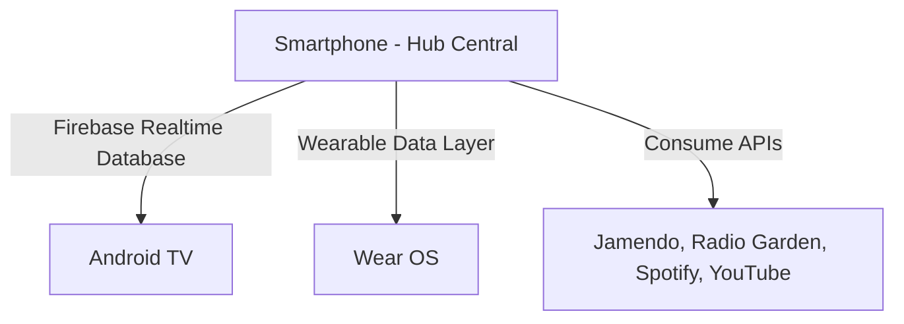

# 🎵 Sintonía — Control Multimedia Inteligente para el Ecosistema Digital

## 👩‍💻 Información del Proyecto

| Campo | Detalle |
| :--- | :--- |
| **Nombre del proyecto** | Sintonía |
| **Estudiantes** | Medrano Hernández Vanesa Monserrat · Tapia Cid Laura Berenice |
| **Matrícula** | 1222100447 · 1222100476 |
| **Grupo** | GIDS6093 |
| **Materia** | Desarrollo para Dispositivos Inteligentes |
| **Docente** | Rodríguez García Anastacio |
| **Institución** | Universidad Tecnológica del Norte de Guanajuato |
| **Periodo** | Mayo – Agosto 2026 |

---

## 🎯 Objetivo

Desarrollar un sistema de control multimedia multiplataforma que integre Smartwatch, Smartphone y Smart TV, combinando fuentes de contenido gratuito y legal (Jamendo y Radio Garden) con comunicación en tiempo real entre los tres dispositivos a través de Firebase Realtime Database.

---

## 📱 Descripción de Funcionalidades

### Smartphone (Hub Central)
*   **Selección de fuente:** Jamendo, Radio Garden y Spotify.
*   **Búsqueda y reproducción:** Acceso a música gratuita con licencia Creative Commons (Jamendo API).
*   **Pantalla de Favoritos:** Función para guardar pistas y acceder rápidamente a ellas, superando las limitaciones de descarga directa de servicios como Spotify.
*   **Streaming Flexible:** Opción para alternar instantáneamente la salida de audio/video entre el Smartphone y la Smart TV.
*   **Gestión:** Reproductor con controles y sincronización total del estado hacia Firebase.
*   **Control Remoto:** Recepción de comandos enviados desde el Smartwatch.

### Smartwatch (Wear OS)
*   Visualización de la canción en reproducción (título y artista).
*   Control de play/pausa directamente desde la muñeca.
*   Sincronización en tiempo real vía Firebase Realtime Database.

### Android TV (Dashboard)
*   **Dashboard Visual:** Muestra portada del álbum, título y artista.
*   **Cola de Reproducción:** Visualización en tiempo real de la lista de próximas canciones, sincronizada automáticamente con el Smartphone.
*   **Indicador de estado:** Estado (reproduciendo / pausado) y visualizador de ondas.
*   **Control Remoto:** Actualización en tiempo real controlada desde el smartphone vía Firebase.

---

## 🏗️ Diagrama de Arquitectura


## 🛠️ Tecnologías Utilizadas

| Tecnología | Uso |
|---|---|
| **Kotlin** | Lenguaje principal |
| **Jetpack Compose** | UI declarativa en los 3 módulos |
| **Material Design 3** | Sistema de diseño |
| **Wear OS SDK** | Módulo smartwatch |
| **Android TV** | Módulo Smart TV |
| **Firebase Realtime Database** | Comunicación en tiempo real |
| **Jamendo API** | Música gratuita bajo Creative Commons |
| **ExoPlayer (Media3)** | Reproducción de audio |
| **Retrofit 2 + OkHttp** | Consumo de APIs REST |
| **Coil** | Carga de imágenes |
| **MVVM + Repository Pattern** | Arquitectura de software |
| **Android Studio** | IDE de desarrollo |
| **Git + GitHub** | Control de versiones |

---

## 🗂️ Estructura del Repositorio

```
sintonia/
├── app/                    # Módulo Smartphone (hub central)
├── wear/                   # Módulo Smartwatch (Wear OS)
├── tv/                     # Módulo Android TV
├── apk/
│   └── sintonia.apk        # APK generado de la app principal
├── evidencias/
│   ├── pantalla_principal.png
│   ├── navegacion.png
│   ├── jamendo_busqueda.png
│   ├── wear_os.png
│   └── android_tv.png
└── README.md
```

---

## ▶️ Instrucciones para Ejecutar el Proyecto

### Requisitos previos
- Android Studio Hedgehog o superior
- JDK 11
- Cuenta en [Firebase Console](https://console.firebase.google.com)
- Cuenta en [Jamendo Developer Portal](https://devportal.jamendo.com) (gratuita)
- Emulador o dispositivo físico:
  - Android 8.0+ (API 26) para el smartphone
  - Wear OS para el smartwatch
  - Android TV para la TV

### Pasos

1. **Clona el repositorio**
   ```bash
   git clone https://github.com/Lau1907/sintonia.git
   cd sintonia
   ```

2. **Configura Firebase**
   - Crea un proyecto en [Firebase Console](https://console.firebase.google.com)
   - Agrega las apps: `com.sintonia.app`, `com.sintonia.wear`, `com.sintonia.tv`
   - Descarga cada `google-services.json` y colócalo en la carpeta raíz de cada módulo
   - Activa **Realtime Database** en modo test

3. **Configura Jamendo**
   - Regístrate en [devportal.jamendo.com](https://devportal.jamendo.com)
   - Crea una aplicación y copia tu **Client ID**
   - Pégalo en `app/src/main/java/com/sintonia/app/data/remote/JamendoApi.kt`
     ```kotlin
     @Query("client_id") clientId: String = "TU_CLIENT_ID_AQUI"
     ```

4. **Abre en Android Studio**
   - File → Open → selecciona la carpeta del proyecto
   - Espera a que Gradle sincronice

5. **Ejecuta cada módulo**
   - Smartphone: selecciona `:app` y corre en emulador de teléfono
   - Smartwatch: selecciona `:wear` y corre en emulador Wear OS
   - TV: selecciona `:tv` y corre en emulador Android TV

---

## 📸 Capturas de Pantalla

### Smartphone — Pantalla Principal


### Smartphone — Pantalla Principal y busqueda en Jamendo


### Smartphone — Pantalla de Spotify


### Smartphone — Pantalla de Radio Garden


### Smartphone — Pantalla de YouTube


### Smartphone — Pantalla de Descargas


### Smartphone — Pantalla de Favoritos


### Smartphone — Pantalla de Cola de Reproducción


### Smartwatch — Control de Reproducción


### Smartwatch — Pantalla de notificación


### Smartwatch — Pantalla de volumen


### Android TV — Pantalla de Spotify


### Android TV — Pantalla de Jamendo


### Android TV — Pantalla de Radio Garden


### Android TV — Pantalla de YouTube


---

## 🔗 APIs Utilizadas

- **Jamendo API** — https://api.jamendo.com/v3.0/ · Música gratuita bajo licencia Creative Commons
- **Firebase Realtime Database** — Comunicación en tiempo real entre dispositivos

---

## 📄 Licencia

Proyecto académico desarrollado para la materia **Desarrollo para Dispositivos Inteligentes** — UTNG, periodo Mayo–Agosto 2026.
